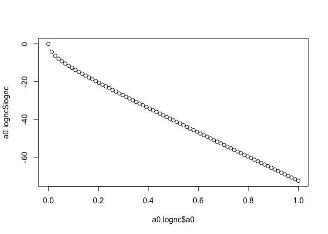

<!-- README.md is generated from README.Rmd. Please edit that file -->

## hdbayes

<!-- badges: start -->

[](https://github.com/ethan-alt/hdbayes/actions)
<!-- badges: end -->

The goal of `hdbayes` is to make it easier for users to conduct Bayesian
analysis methods that leverage historical data.

## Setting up MCMC parameters

We begin by setting up parameters for the MCMC. We detect the number of
cores on our machine as well as set up the warmup and total number of
desired samples.

``` r
## obtain number of cores
ncores = max(1, parallel::detectCores() - 1)
warmup  = 1000          ## warmup for MCMC sampling
total.samples = 10000   ## number of samples post warmup
samples = ceiling(warmup + total.samples / ncores)  ## outputs approx total.samples samples
```

## Simulating logistic regression data

We now simulate some logistic regression data.

``` r
## simulate logistic regression data
set.seed(391)
n  = 200
n0 = 100
N  = n + n0

X    = cbind(1, 'z' = rbinom(N, 1, 0.5), 'x' = rnorm(N, mean = 1, sd = 1) )
beta = c(1, 0.5, -1)
mean = binomial('logit')$linkinv(X %*% beta)
y    = rbinom(N, 1, mean)

## create current and historical data sets
data = data.frame('y' = y, 'z' = X[, 'z'], 'x' = X[, 'x'])
histdata = data[1:n0, ]
data     = data[-(1:n0), ]
```

## Frequentist analysis of the data sets

We use the `stats::glm` function to conduct a frequentist GLM of the
data sets

``` r
formula = y ~ z + x
family  = binomial('logit')
fit.mle.cur  = glm(formula, family, data)
fit.mle.hist = glm(formula, family, histdata)

summary(fit.mle.cur)
#> 
#> Call:
#> glm(formula = formula, family = family, data = data)
#> 
#> Deviance Residuals: 
#>     Min       1Q   Median       3Q      Max  
#> -1.7907  -1.1360   0.6741   1.0005   1.9255  
#> 
#> Coefficients:
#>             Estimate Std. Error z value Pr(>|z|)    
#> (Intercept)   0.7600     0.2744   2.769  0.00562 ** 
#> z             0.6769     0.3078   2.199  0.02787 *  
#> x            -0.7500     0.1814  -4.134 3.56e-05 ***
#> ---
#> Signif. codes:  0 '***' 0.001 '**' 0.01 '*' 0.05 '.' 0.1 ' ' 1
#> 
#> (Dispersion parameter for binomial family taken to be 1)
#> 
#>     Null deviance: 273.33  on 199  degrees of freedom
#> Residual deviance: 250.60  on 197  degrees of freedom
#> AIC: 256.6
#> 
#> Number of Fisher Scoring iterations: 4
```

We will compare these with the Bayesian analysis results later

## Bayesian analysis methods

We now utilize the functions in this package.

### Bayesian hierarchical model

The Bayesian hierarchical model (BHM) is the following model:
$$
\\begin{align\*}
  y_i \| x_i, \\beta &\\sim \\text{Bernoulli}\\left( \\text{logit}^{-1}(x_i'\\beta) \\right) \\\\
  y\_{0i} \| x\_{0i}, \\beta_0 &\\sim \\text{Bernoulli}\\left( \\text{logit}^{-1}(x\_{0i}'\\beta_0) \\right) \\\\
  \\beta, \\beta_0 &\\sim N_p(\\mu, \\Sigma) \\\\
  \\mu &\\sim N_p(\\mu_0, \\Sigma_0) \\\\
  \\Sigma &\\sim \\text{IW}\_p(\\nu_0, \\Psi_0)
\\end{align\*}
$$
where *β* is the vector of regression coefficients of the current data
set, *β*<sub>0</sub> is the vector of regression coefficients for the
historical data set, *μ* is the common prior mean of *β* and
*β*<sub>0</sub>, which is treated as random with a normal hyperprior
having mean *μ*<sub>0</sub>, and covariance *Σ*<sub>0</sub>, and *Σ* is
also treated as random, having an inverse-Wishart hyperprior with
*ν*<sub>0</sub> degrees of freedom and scale matrix *Ψ*<sub>0</sub>.

The defaults in `hdbayes` are

-   *μ*<sub>0</sub> = 0
-   *Σ*<sub>0</sub> = *I*<sub>*p*</sub>
-   *ν*<sub>0</sub> = *p* + 10
-   *Ψ*<sub>0</sub> = *I*<sub>*p*</sub> where *p* is the number of
    predictors (including the intercept if applicable).

We fit this model as follows

    #>                           mean      se_mean         sd          2.5%
    #> (Intercept)       8.052683e-01 0.0030895909 0.23973047    0.33722729
    #> z                 5.902788e-01 0.0030262837 0.26878959    0.06481313
    #> x                -7.511122e-01 0.0019259565 0.16158975   -1.07324767
    #> (Intercept)_hist  8.768941e-01 0.0036030297 0.28045886    0.33860907
    #> z_hist            4.531843e-01 0.0037264702 0.32411482   -0.18152623
    #> x_hist           -7.995575e-01 0.0023493252 0.20882016   -1.22105373
    #> beta_mean[1]      8.034912e-01 0.0038123387 0.30258879    0.20539788
    #> beta_mean[2]      4.967166e-01 0.0039165442 0.32572386   -0.13763029
    #> beta_mean[3]     -7.347558e-01 0.0029824754 0.26133151   -1.24444681
    #> beta_cov[1,1]     1.046006e-01 0.0006252476 0.05237191    0.04347313
    #> beta_cov[1,2]    -1.541210e-03 0.0004484335 0.03557674   -0.07452877
    #> beta_cov[1,3]    -1.984188e-03 0.0004395277 0.03469972   -0.07486069
    #> beta_cov[2,1]    -1.541210e-03 0.0004484335 0.03557674   -0.07452877
    #> beta_cov[2,2]     1.059451e-01 0.0006946712 0.05198822    0.04470775
    #> beta_cov[2,3]    -6.211464e-04 0.0004701395 0.03461615   -0.07088761
    #> beta_cov[3,1]    -1.984188e-03 0.0004395277 0.03469972   -0.07486069
    #> beta_cov[3,2]    -6.211464e-04 0.0004701395 0.03461615   -0.07088761
    #> beta_cov[3,3]     1.019442e-01 0.0007131144 0.04979480    0.04356192
    #> lp__             -1.520742e+02 0.0516629493 3.09162208 -159.20234678
    #>                            25%           50%           75%         97.5%
    #> (Intercept)         0.64662203  8.047405e-01    0.96521350    1.28172382
    #> z                   0.40829500  5.877005e-01    0.77170096    1.12236396
    #> x                  -0.85903653 -7.503971e-01   -0.63997738   -0.43635759
    #> (Intercept)_hist    0.68879441  8.742509e-01    1.06157509    1.44229089
    #> z_hist              0.23268648  4.489438e-01    0.67128466    1.08809895
    #> x_hist             -0.93620373 -8.010963e-01   -0.65956900   -0.39415499
    #> beta_mean[1]        0.60316598  8.026279e-01    1.00703105    1.39631331
    #> beta_mean[2]        0.27898222  4.975964e-01    0.71459727    1.12546144
    #> beta_mean[3]       -0.90872086 -7.375926e-01   -0.56077983   -0.22127253
    #> beta_cov[1,1]       0.07007767  9.214611e-02    0.12453123    0.23853743
    #> beta_cov[1,2]      -0.01972013 -1.403638e-03    0.01725609    0.06726339
    #> beta_cov[1,3]      -0.01931963 -1.585131e-03    0.01569150    0.06838487
    #> beta_cov[2,1]      -0.01972013 -1.403638e-03    0.01725609    0.06726339
    #> beta_cov[2,2]       0.07122460  9.367780e-02    0.12581250    0.23981468
    #> beta_cov[2,3]      -0.01802127 -4.046078e-04    0.01673658    0.06967690
    #> beta_cov[3,1]      -0.01931963 -1.585131e-03    0.01569150    0.06838487
    #> beta_cov[3,2]      -0.01802127 -4.046078e-04    0.01673658    0.06967690
    #> beta_cov[3,3]       0.06895160  8.998191e-02    0.12115952    0.23126098
    #> lp__             -153.91042260 -1.516919e+02 -149.84853136 -147.04691451
    #>                     n_eff      Rhat
    #> (Intercept)      6020.666 1.0003837
    #> z                7888.703 0.9998923
    #> x                7039.384 1.0006917
    #> (Intercept)_hist 6059.024 1.0005997
    #> z_hist           7564.887 1.0000482
    #> x_hist           7900.572 1.0004385
    #> beta_mean[1]     6299.741 0.9999307
    #> beta_mean[2]     6916.607 1.0005364
    #> beta_mean[3]     7677.676 1.0002446
    #> beta_cov[1,1]    7016.053 1.0001007
    #> beta_cov[1,2]    6294.136 1.0013830
    #> beta_cov[1,3]    6232.746 1.0003629
    #> beta_cov[2,1]    6294.136 1.0013830
    #> beta_cov[2,2]    5600.817 1.0008703
    #> beta_cov[2,3]    5421.308 1.0003813
    #> beta_cov[3,1]    6232.746 1.0003629
    #> beta_cov[3,2]    5421.308 1.0003813
    #> beta_cov[3,3]    4875.843 1.0015506
    #> lp__             3581.083 1.0012104

### Commensurate prior

The commensurate prior assumes the following hierarchical model
$$
\\begin{align\*}
  y_i \| x_i, \\beta &\\sim \\text{Bernoulli}\\left( \\text{logit}^{-1}(x_i'\\beta) \\right) \\\\
  y\_{0i} \| x\_{0i}, \\beta_0 &\\sim \\text{Bernoulli}\\left( \\text{logit}^{-1}(x\_{0i}'\\beta_0) \\right) \\\\
  \\beta_0 &\\sim N_p(\\mu_0, \\Sigma_0) \\\\
  \\beta_j &\\sim N_1\\left( \\beta\_{0j}, \\tau_j^{-1} \\right), j = 1, \\ldots, p
\\end{align\*}
$$
where the *τ*<sub>*j*</sub>’s are elicited by the user. The defaults in
`hdbayes` are

-   *μ*<sub>0</sub> = 0
-   *Σ*<sub>0</sub> = 100 × *I*<sub>*p*</sub>

This method can be fit as follows

``` r
fit.commensurate = glm.commensurate(
  formula, family, data, histdata, tau = rep(5, 3),
  cores = ncores, chains = ncores, iter = samples, warmup = warmup, refresh = 0
)
summary(fit.commensurate)$summary
#>                          mean     se_mean        sd          2.5%          25%
#> (Intercept)         0.8446287 0.003016447 0.2465664    0.37126598    0.6746845
#> z                   0.6108188 0.003124367 0.2790540    0.06433878    0.4230547
#> x                  -0.7844826 0.002028881 0.1699129   -1.12373097   -0.8977350
#> (Intercept)_hist    0.9326511 0.003711776 0.3002525    0.34079286    0.7270778
#> z_hist              0.4782358 0.003849514 0.3405075   -0.18974097    0.2480055
#> x_hist             -0.8474290 0.002774120 0.2231205   -1.29700026   -0.9983885
#> lp__             -190.4343723 0.026491954 1.7472399 -194.75168729 -191.3345233
#>                           50%          75%        97.5%    n_eff     Rhat
#> (Intercept)         0.8416200    1.0098550    1.3314332 6681.533 1.000368
#> z                   0.6112092    0.8008442    1.1620960 7977.236 1.000440
#> x                  -0.7812012   -0.6702640   -0.4565732 7013.581 1.000711
#> (Intercept)_hist    0.9306189    1.1328784    1.5298116 6543.495 1.000668
#> z_hist              0.4748945    0.7045581    1.1537379 7824.225 1.000408
#> x_hist             -0.8442757   -0.6916453   -0.4233025 6468.872 1.000223
#> lp__             -190.1173150 -189.1668303 -188.0061950 4349.878 1.000406
```

### Robust Meta-Analytic Predictive (MAP) Prior

The Robust MAP prior is a generalization of the Bayesian Hierarchical
Model (BHM), and takes the form

$$
\\begin{align\*}
  y_i \| x_i, \\beta &\\sim \\text{Bernoulli}\\left( \\text{logit}^{-1}(x_i'\\beta) \\right) \\\\
  y\_{0i} \| x\_{0i}, \\beta_0 &\\sim \\text{Bernoulli}\\left( \\text{logit}^{-1}(x\_{0i}'\\beta_0) \\right) \\\\
  \\beta_0 &\\sim N_p(\\mu, \\Sigma) \\\\
  \\beta   &\\sim w \\times N_p(\\mu, \\Sigma) + (1 - w) N_p(\\mu_v, \\Sigma_v) \\\\
  \\mu &\\sim N_p(\\mu_0, \\Sigma_0) \\\\
  \\Sigma &\\sim \\text{IW}\_p(\\nu_0, \\Psi_0)
\\end{align\*}
$$

where *w* ∈ (0,1) controls for the level of borrowing of the historical
data. Note that when *w* = 1, the robust MAP prior effectively becomes
the BHM. The defaults are the same as in the BHM except the default
value for w is 0.1.

``` r
fit.robustmap = glm.robustmap(
  formula, family, data, histdata,
  cores = ncores, chains = ncores, iter = samples, warmup = warmup, refresh = 0
)
summary(fit.robustmap)$summary
#>                           mean      se_mean         sd          2.5%
#> (Intercept)       8.103342e-01 0.0029690516 0.23774977    0.35208083
#> z                 5.903156e-01 0.0030181718 0.26497241    0.06992649
#> x                -7.552516e-01 0.0020049752 0.16473964   -1.08515275
#> (Intercept)_hist  8.819346e-01 0.0034160151 0.28002842    0.33508937
#> z_hist            4.537888e-01 0.0036427716 0.32443238   -0.18224512
#> x_hist           -8.050396e-01 0.0024362828 0.21112830   -1.22968197
#> coef_mean[1]      8.033461e-01 0.0037517052 0.30344386    0.19161975
#> coef_mean[2]      4.974429e-01 0.0039094873 0.32378163   -0.13715903
#> coef_mean[3]     -7.406323e-01 0.0030181458 0.26118841   -1.25451461
#> coef_cov[1,1]     1.046761e-01 0.0006665779 0.05263615    0.04466148
#> coef_cov[1,2]    -1.896565e-03 0.0004741366 0.03582686   -0.07582440
#> coef_cov[1,3]    -2.692340e-03 0.0004716160 0.03567206   -0.07626998
#> coef_cov[2,1]    -1.896565e-03 0.0004741366 0.03582686   -0.07582440
#> coef_cov[2,2]     1.056426e-01 0.0007544843 0.05404112    0.04448673
#> coef_cov[2,3]    -9.787937e-05 0.0005032397 0.03613699   -0.07181367
#> coef_cov[3,1]    -2.692340e-03 0.0004716160 0.03567206   -0.07626998
#> coef_cov[3,2]    -9.787937e-05 0.0005032397 0.03613699   -0.07181367
#> coef_cov[3,3]     1.017623e-01 0.0008846554 0.05406755    0.04353963
#> lp__             -1.570790e+02 0.0541874326 3.12400631 -164.22040793
#>                            25%           50%           75%         97.5%
#> (Intercept)         0.65126180  8.054250e-01    0.96986023    1.27881565
#> z                   0.40984542  5.888679e-01    0.76675857    1.10874863
#> x                  -0.86454119 -7.521524e-01   -0.64249913   -0.43975356
#> (Intercept)_hist    0.69512526  8.802774e-01    1.06580108    1.43477537
#> z_hist              0.23582309  4.540621e-01    0.67129464    1.08804052
#> x_hist             -0.94712204 -7.994152e-01   -0.66212388   -0.40506312
#> coef_mean[1]        0.60527157  8.049493e-01    1.00487416    1.39883690
#> coef_mean[2]        0.27760169  4.986778e-01    0.71651439    1.13479337
#> coef_mean[3]       -0.91260109 -7.423264e-01   -0.57121361   -0.23112320
#> coef_cov[1,1]       0.07027136  9.215533e-02    0.12460162    0.23713129
#> coef_cov[1,2]      -0.01904309 -8.332333e-04    0.01659887    0.06624494
#> coef_cov[1,3]      -0.01913457 -1.337795e-03    0.01530414    0.06518051
#> coef_cov[2,1]      -0.01904309 -8.332333e-04    0.01659887    0.06624494
#> coef_cov[2,2]       0.07040307  9.333983e-02    0.12530921    0.24562921
#> coef_cov[2,3]      -0.01753373  2.336528e-05    0.01745446    0.06886161
#> coef_cov[3,1]      -0.01913457 -1.337795e-03    0.01530414    0.06518051
#> coef_cov[3,2]      -0.01753373  2.336528e-05    0.01745446    0.06886161
#> coef_cov[3,3]       0.06886427  8.962741e-02    0.12002231    0.23058171
#> lp__             -158.92419171 -1.567139e+02 -154.83290774 -152.09515508
#>                     n_eff      Rhat
#> (Intercept)      6412.166 0.9998669
#> z                7707.498 1.0000921
#> x                6751.157 0.9998122
#> (Intercept)_hist 6719.929 1.0000988
#> z_hist           7932.033 1.0000604
#> x_hist           7509.958 1.0006816
#> coef_mean[1]     6541.830 1.0004286
#> coef_mean[2]     6859.063 1.0001015
#> coef_mean[3]     7489.061 1.0005274
#> coef_cov[1,1]    6235.431 0.9999270
#> coef_cov[1,2]    5709.664 1.0003028
#> coef_cov[1,3]    5721.097 1.0000676
#> coef_cov[2,1]    5709.664 1.0003028
#> coef_cov[2,2]    5130.365 1.0003296
#> coef_cov[2,3]    5156.491 1.0001105
#> coef_cov[3,1]    5721.097 1.0000676
#> coef_cov[3,2]    5156.491 1.0001105
#> coef_cov[3,3]    3735.297 1.0019524
#> lp__             3323.737 1.0017587
```

### Power prior

The Power Prior takes the form
$$
\\begin{align}
  y_i \| x_i, \\beta &\\sim \\text{Bernoulli}\\left( \\text{logit}^{-1}(x_i'\\beta) \\right) \\\\
  y\_{0i} \| x\_{0i}, \\beta &\\sim \\text{Bernoulli}\\left( \\text{logit}^{-1}(x\_{0i}'\\beta) \\right) \\\\
  \\pi(\\beta \| a_0) &\\propto L(\\beta \| y_0)^{a_0} \\pi_0(\\beta)
\\end{align}
$$
where *L*(*β*\|*y*<sub>0</sub>) is the likelihood of the GLM based on
the historical data, *a*<sub>0</sub> ∈ (0,1) is a fixed hyperaparameter
controlling the effective sample size contributed by the data (e.g.,
*a*<sub>0</sub> = 1 borrows the whole sample size), and
*π*<sub>0</sub>(*β*) is an “initial prior” on *β*.

The default in `hdbayes` is a (noninformative) normal prior on *β*:
*β* ∼ *N*<sub>*p*</sub>(0,100×*I*<sub>*p*</sub>)

The power prior (with *a*<sub>0</sub> = 0.5) may be fit as follows:

``` r
fit.pp = glm.pp(
  formula, family, data, histdata, a0 = 0.5,
  cores = ncores, chains = ncores, iter = samples, warmup = warmup, refresh = 0
)
```

### Normalized power prior (NPP)

The NPP treats the hyperparameter *a*<sub>0</sub> as random, allowing
the data to decide what is the best value. For non-Gaussian models, this
requires estimating the normalizing constant
*Z*(*a*<sub>0</sub>) = ∫*L*(*β*\|*y*<sub>0</sub>)<sup>*a*<sub>0</sub></sup>*π*<sub>0</sub>(*β*)*d**β*.

In `hdbayes`, there is one function to estimate the normalizing constant
across a grid of values for *a*<sub>0</sub> and another to obtain
posterior samples of the normalized power prior.

The NPP may be summarized as
$$
\\begin{align}
  y_i \| x_i, \\beta &\\sim \\text{Bernoulli}\\left( \\text{logit}^{-1}(x_i'\\beta) \\right) \\\\
  y\_{0i} \| x\_{0i}, \\beta &\\sim \\text{Bernoulli}\\left( \\text{logit}^{-1}(x\_{0i}'\\beta) \\right) \\\\
  \\pi(\\beta \| a_0) &\\propto \\frac{1}{Z(a_0)} L(\\beta \| y_0)^{a_0} \\pi_0(\\beta) \\\\
  \\pi(a_0)         &\\propto a_0^{\\alpha_0 - 1} (1 - a_0)^{\\gamma_0 - 1}
\\end{align}
$$

The defaults in `hdbayes` are

-   *π*<sub>0</sub>(*β*) ∝ *N*(*β*\|0,100×*I*<sub>*p*</sub>)
-   *α*<sub>0</sub> = 1
-   *γ*<sub>0</sub> = 1

when *α*<sub>0</sub> = 1 and *γ*<sub>0</sub> = 1, the prior on
*a*<sub>0</sub> is a *U*(0,1) prior.

### Estimating the normalizing constant

We begin by estimating the normalizing constant over a fine grid of
values. On machines with multiple cores, this may be accomplished more
efficiently using parallel computing.

``` r
## parallelize estimation of log normalizing constant
library(parallel)
a0     = seq(0, 1, length.out = ncores * 5)

## wrapper to obtain log normalizing constant in parallel package
logncfun = function(a0, ...)
  hdbayes::glm.npp.lognc(
    formula = formula, family = family, histdata = histdata, a0 = a0, ...
  )

cl = makeCluster(ncores)
  clusterSetRNGStream(cl, 123)
  clusterExport(cl, varlist = c('formula', 'family', 'histdata'))
  
  ## call created function
  a0.lognc = parLapply(
    cl = cl, X = a0, fun = logncfun, iter = 5000, warmup = warmup, refresh = 0
  )
stopCluster(cl)

a0.lognc = data.frame( do.call(rbind, a0.lognc) )
head(a0.lognc)
#>           a0        lognc min_n_eff max_Rhat
#> 1 0.00000000  9.451078691  4237.621 1.001168
#> 2 0.02941176  3.076353738  4720.327 1.000376
#> 3 0.05882353  0.003102988  4318.647 1.000745
#> 4 0.08823529 -2.518622980  5116.200 1.000483
#> 5 0.11764706 -4.829003994  5109.575 1.000962
#> 6 0.14705882 -7.016724008  5372.618 1.000905
```

The provided function `glm.npp.lognc` estimates the logarithm of the
normalizing constant, log *Z*(*a*<sub>0</sub>), for one specific value
of *a*<sub>0</sub>. We created the function `logncfun` so that the first
argument would be *a*<sub>0</sub>, allowing us to use the `parLapply`
function in the `parallel` package.

The `hdbayes` function `glm.npp.lognc` outputs *a*<sub>0</sub>,
*Z*(*a*<sub>0</sub>), and the minimum effective sample size and maximum
R-hat value of the MCMC sampling of the power prior. It is a good idea
to check that the minimum effective sample size is at least 1,000 and
the maximum R-hat value is less than 1.10

``` r
min(a0.lognc$min_n_eff) ## lowest effective sample size
#> [1] 4237.621
max(a0.lognc$max_Rhat)  ## highest R-hat value
#> [1] 1.002398
```

We can then plot the logarithm of the normalizing constant

``` r
plot(a0.lognc$a0, a0.lognc$lognc)
```

<!-- -->

### Sampling the posterior distribution

We can now sample from the posterior distribution. The function
`glm.npp` takes, as input, values of *a*<sub>0</sub> and the estimated
logarithm of the normalizing constant. Linear interpolation is used to
estimate *Z*(*a*<sub>0</sub>) for values not in the fine grid. Thus, it
may be a good idea to conduct smoothing of the function such as using
LOESS, but we ignore that here.

``` r
fit.npp = glm.npp(
  formula, family, data, histdata, a0 = a0.lognc$a0, lognc = a0.lognc$lognc,
  cores = ncores, chains = ncores, iter = samples, warmup = warmup, refresh = 0
)
summary(fit.npp)$summary
#>                     mean     se_mean        sd          2.5%          25%
#> (Intercept)    0.8503634 0.003123968 0.2374531    0.38970311    0.6916523
#> z              0.5961681 0.003375519 0.2657151    0.08257295    0.4159474
#> x             -0.7949403 0.002074815 0.1610898   -1.12081757   -0.9002196
#> a0             0.6790218 0.002466096 0.2204259    0.20559246    0.5242087
#> lp__        -128.8461233 0.022953418 1.4796290 -132.56218599 -129.5969465
#>                      50%          75%        97.5%    n_eff     Rhat
#> (Intercept)    0.8520357    1.0075232    1.3201998 5777.536 1.000240
#> z              0.5943031    0.7730748    1.1149716 6196.569 1.000127
#> x             -0.7924030   -0.6862577   -0.4847306 6028.055 1.000440
#> a0             0.7130063    0.8638194    0.9865038 7989.241 1.000625
#> lp__        -128.5179152 -127.7487009 -126.9993580 4155.382 1.002071
```

### Normalized asymptotic power prior (NAPP)

NAPP uses a large sample theory argument to formulate a normal
approximation to the power prior, i.e., the prior is given by
*β*\|*a*<sub>0</sub> ∼ *N*(*β̂*<sub>0</sub>,*a*<sub>0</sub><sup>−1</sup>\[*I*<sub>*n*</sub>(*β*)\]<sup>−1</sup>),
where *β̂*<sub>0</sub> is the maximum likelihood estimate (MLE) of *β*
based on the historical data and *I*<sub>*n*</sub>(*β*) is the
associated information matrix (negative Hessian).

In this case, the normalizing constant is known, so we do not need to
estimate the normalizing constant before sampling.

The following code analyzes the data set using the NAPP:

``` r
fit.napp = glm.napp(
  formula, family, data, histdata,
  cores = ncores, chains = ncores, iter = samples, warmup = warmup, refresh = 0
)
summary(fit.napp)$summary
#>                     mean     se_mean        sd         2.5%          25%
#> (Intercept)    0.8829981 0.002914998 0.2089421    0.4717916    0.7445032
#> z              0.5322467 0.002924776 0.2350868    0.0788317    0.3734167
#> x             -0.8007139 0.001978010 0.1420935   -1.0879610   -0.8930201
#> a0             0.7602547 0.002172473 0.1858673    0.3239161    0.6474707
#> lp__        -125.7356454 0.024014471 1.4938584 -129.4802290 -126.4931020
#>                      50%          75%        97.5%    n_eff      Rhat
#> (Intercept)    0.8830876    1.0231093    1.2927564 5137.779 1.0000052
#> z              0.5263813    0.6866162    1.0096968 6460.579 0.9994489
#> x             -0.8009764   -0.7061845   -0.5223600 5160.494 1.0000614
#> a0             0.8015021    0.9112882    0.9923785 7319.763 1.0002243
#> lp__        -125.4060583 -124.6200652 -123.8608490 3869.660 1.0023110
```

## Comparison of methods

We now can compare the point estimate (MLE / posterior mean) and
uncertainty (SE / posterior standard deviation) of the methods.

``` r
##
## COMPARE METHODS
##
fit.list = list('bhm' = fit.bhm, 'commensurate' = fit.commensurate,
                'robustmap' = fit.robustmap, 'napp' = fit.napp,
                'npp' = fit.npp, 'pp' = fit.pp)

post.mean = sapply(
  fit.list, function(x) summary(x)$summary[names(coef(fit.mle.cur)), 'mean']
)
post.sd = sapply(
  fit.list, function(x) summary(x)$summary[names(coef(fit.mle.cur)), 'sd']
)

post.mean = cbind(
  'truth' = beta,
  'mle.cur' = coef(fit.mle.cur),
  'mle.hist' = coef(fit.mle.hist),
  post.mean
)

post.sd = cbind(
  'mle.cur'  = summary(fit.mle.cur)$coefficients[, 'Std. Error'],
  'mle.hist' = summary(fit.mle.hist)$coefficients[, 'Std. Error'],
  post.sd
)

## posterior means
post.mean
#>             truth    mle.cur   mle.hist        bhm commensurate  robustmap
#> (Intercept)   1.0  0.7600134  1.0356407  0.8052683    0.8446287  0.8103342
#> z             0.5  0.6769090  0.3132406  0.5902788    0.6108188  0.5903156
#> x            -1.0 -0.7500219 -0.8564340 -0.7511122   -0.7844826 -0.7552516
#>                   napp        npp         pp
#> (Intercept)  0.8829981  0.8503634  0.8339389
#> z            0.5322467  0.5961681  0.6112212
#> x           -0.8007139 -0.7949403 -0.7880279

## posterior std dev.
post.sd
#>               mle.cur  mle.hist       bhm commensurate robustmap      napp
#> (Intercept) 0.2744442 0.3774026 0.2397305    0.2465664 0.2377498 0.2089421
#> z           0.3078005 0.4416386 0.2687896    0.2790540 0.2649724 0.2350868
#> x           0.1814124 0.2655722 0.1615897    0.1699129 0.1647396 0.1420935
#>                   npp        pp
#> (Intercept) 0.2374531 0.2451511
#> z           0.2657151 0.2854827
#> x           0.1610898 0.1632455
```
