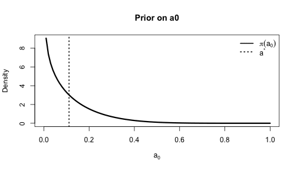
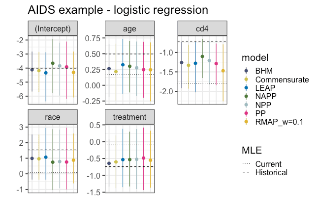
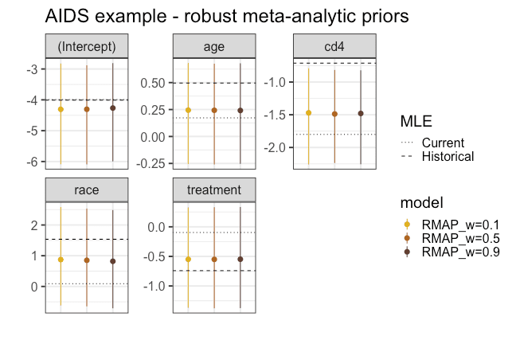
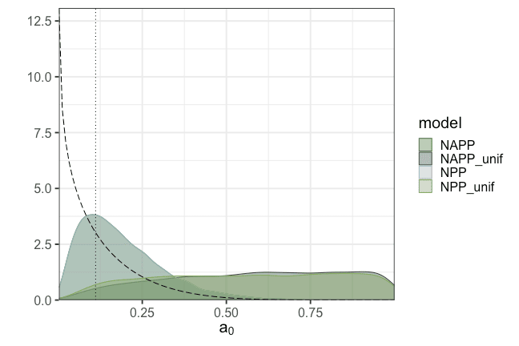

Here we will analyse the data in Section 4.2 of @Chen1999 using a logistic regression
model.
The analysis consists of two AIDS clinical trials called ACTG036 and ACTG019,
the data for which can be accessed by calling `data(actg036)` and
`data(actg019)`, respectively (see below).

The historical data will come from the ACTG019 (@Volberding1990) study, which
was a double-blind placebo-controlled clinical trial comparing zidovudine (AZT)
with a placebo in people with CD4 cell counts less than 500.
The sample size of complete observations for this study was $n_0 = 822$.
The response variable ($y_0$) for these data is binary, with 1 indicating death,
development of AIDS or ARC and 0 otherwise.
We will use the following covariates:  `cd4` (CD4 cell count), `age`, `treatment` and
`race`.
To facilitate computation, we will center and scale the continuous covariates (`age` and `cd4`) based on the current data.
In general, we recommend this centering procedure in order to keep coefficients on roughly the same scale and thus avoid difficult posterior geometries for the Stan dynamic Hamiltonian Monte Carlo (dHMC) procedure to explore.

We will use the methods in **hdbayes** to construct informative priors using the
ACTG019 data as historical data in order to analyze the data from ACTG036 study
(@Merigan1991), for which we will use the same four covariates.
For the ACTG036 study the sample size was $n = 183$.

Let's take a look at the data and take the opportunity to center and scale the continuous
covariates (`cd4` and `age`):


``` r
library(hdbayes)
library(posterior)
library(dplyr)
library(parallel)
library(ggplot2)
library(tibble)
```


``` r
age_stats <- with(actg036,
                  c('mean' = mean(age), 'sd' = sd(age)))
cd4_stats <- with(actg036,
                  c('mean' = mean(cd4), 'sd' = sd(cd4)))
actg036$age <- ( actg036$age - age_stats['mean'] ) / age_stats['sd']
actg019$age <- ( actg019$age - age_stats['mean'] ) / age_stats['sd']
actg036$cd4 <- ( actg036$cd4 - cd4_stats['mean'] ) / cd4_stats['sd']
actg019$cd4 <- ( actg019$cd4 - cd4_stats['mean'] ) / cd4_stats['sd']
```

To establish a baseline, we will estimate the parameters via maximum likelihood,
using `glm()` from **stats**:


``` r
formula <- outcome ~  age + race + treatment + cd4
p       <- length(attr(terms(formula), "term.labels")) # number of predictors
family  <- binomial('logit')
# frequentist analysis of current and historical data separately using GLM
fit.mle.cur  <- glm(formula, family, actg036)
fit.mle.hist <- glm(formula, family, actg019)

summary(fit.mle.hist)
#> 
#> Call:
#> glm(formula = formula, family = family, data = actg019)
#> 
#> Coefficients:
#>             Estimate Std. Error z value Pr(>|z|)    
#> (Intercept)  -4.0106     1.0276  -3.903 9.51e-05 ***
#> age           0.4958     0.1921   2.581  0.00984 ** 
#> race          1.5368     1.0244   1.500  0.13355    
#> treatment    -0.7412     0.3043  -2.436  0.01485 *  
#> cd4          -0.7109     0.1615  -4.402 1.07e-05 ***
#> ---
#> Signif. codes:  0 '***' 0.001 '**' 0.01 '*' 0.05 '.' 0.1 ' ' 1
#> 
#> (Dispersion parameter for binomial family taken to be 1)
#> 
#>     Null deviance: 398.43  on 821  degrees of freedom
#> Residual deviance: 360.54  on 817  degrees of freedom
#> AIC: 370.54
#> 
#> Number of Fisher Scoring iterations: 7
summary(fit.mle.cur)
#> 
#> Call:
#> glm(formula = formula, family = family, data = actg036)
#> 
#> Coefficients:
#>             Estimate Std. Error z value Pr(>|z|)    
#> (Intercept) -3.99251    1.30107  -3.069 0.002150 ** 
#> age          0.17270    0.33265   0.519 0.603648    
#> race         0.08954    1.18186   0.076 0.939607    
#> treatment   -0.09600    0.71886  -0.134 0.893761    
#> cd4         -1.80039    0.49731  -3.620 0.000294 ***
#> ---
#> Signif. codes:  0 '***' 0.001 '**' 0.01 '*' 0.05 '.' 0.1 ' ' 1
#> 
#> (Dispersion parameter for binomial family taken to be 1)
#> 
#>     Null deviance: 83.180  on 182  degrees of freedom
#> Residual deviance: 61.527  on 178  degrees of freedom
#> AIC: 71.527
#> 
#> Number of Fisher Scoring iterations: 7

suppressMessages(confint(fit.mle.hist))
#>                   2.5 %     97.5 %
#> (Intercept) -6.90140344 -2.4402829
#> age          0.11373107  0.8703403
#> race        -0.02626701  4.4242649
#> treatment   -1.35741690 -0.1576862
#> cd4         -1.03097071 -0.3957758
suppressMessages(confint(fit.mle.cur))
#>                  2.5 %     97.5 %
#> (Intercept) -7.2372472 -1.8398296
#> age         -0.5130633  0.8126854
#> race        -1.9320180  3.1410322
#> treatment   -1.5747131  1.3168469
#> cd4         -2.9132023 -0.9259674

the.data <-  list(actg036, actg019)
```
from which we can see quite some discrepancy in the coefficient estimates.
In particular, there is substantial uncertainty in the estimates of the treatment
effect, as evidenced by a wide 95% confidence interval.
We would thus like to incorporate information from the ACTG019 trial into a prior
distribution for the regression coefficients.
We will use the plethora of methods available in **hdbayes** to construct informative priors using the available historical data.


## Bayesian Hierarchical model (BHM)

Our first approach will be to fit a Bayesian hierarchical model (BHM), where we model
the coefficients for historical and current data jointly through a hierarchical (multilevel) structure: the coefficients for each study are drawn from the same multivariate normal distribution. The hyperparameters of this distribution are also assigned hyperpriors.

In summary, we employ the model:
$$
\begin{align*}
  y_i | x_i, \beta &\sim \text{Bernoulli}\left( \text{logit}^{-1}(x_i'\beta) \right), \ \ i = 1, \ldots, n \\
  y_{0i} | x_{0i}, \beta_{0} &\sim \text{Bernoulli}\left( \text{logit}^{-1}(x_{0i}'\beta_{0}) \right), \ \ i = 1, \ldots, n_{0} \\
  \beta, \beta_{0} &\sim N_p(\mu, \Sigma), \text{ where }\Sigma = \text{diag}(\sigma_1^2, \ldots, \sigma_p^2) \\
  \mu &\sim N_p(\mu_0, \Sigma_{0}), \text{ where } \Sigma_{0} \text{ is a diagonal matrix} \\
  \sigma_j &\sim N^{+}(\nu_{0,j}, \psi_{0,j}^2),\: j = 1, \ldots, p
\end{align*}
$$

where $\beta$ is the vector of regression coefficients of the current data
set, $\beta_{0}$ is the vector of regression coefficients for the historical data
set, $\mu$ is the common prior mean of $\beta$ and $\beta_{0}$, which is
treated as random with a normal hyperprior having mean $\mu_0$, and a diagonal
covariance matrix $\Sigma_{0}$. $\Sigma$ is also treated as random and assumed
to be a diagonal matrix. Half-normal hyperpriors are elicited on the diagonal
entries of $\Sigma$.

We set

* $\mu_0 = \textbf{0}_p$, where $\textbf{0}_p$ denotes a $p$-dimensional vector of 0s
* $\Sigma_{0} = 100 \times I_p$
* $\nu_{0,j} = 0$ for $j = 1, \ldots, p$
* $\psi_{0,j} = 0.5$ for $j = 1, \ldots, p$
where $p$ is the number of predictors (including the intercept if applicable).

To fit this model, let us first set up the computational specs, which will also be
used in the subsequent analyses.


``` r
ncores        <- 4 # maximum number of MCMC chains to run in parallel
nchains       <- 4 # number of Markov chains
iter_warmup   <- 1000 # warmup per chain for MCMC sampling
iter_sampling <- 2500 # number of samples post warmup per chain

base.pars     <- c("(Intercept)", "age", "race", "treatment", "cd4")

# function to pull out the posterior summaries in a convenient form
get_summaries <- function(fit, pars.interest, digits = 2) {
  out <- suppressWarnings(subset(posterior::summarise_draws(fit,
                                           .num_args = list(
                                             sigfig = digits,
                                             notation = "dec"
                                           )),
                variable %in% pars.interest))
  return(out)
}
```

Now, a simple call to `glm.bhm()` will fit the model:

``` r
time.bhm <- system.time(
  if (instantiate::stan_cmdstan_exists()) {
    fit.bhm <- glm.bhm(
      formula, family, the.data,
      meta.mean.mean = 0, meta.mean.sd = 10,
      meta.sd.mean = 0, meta.sd.sd = 0.5,
      iter_warmup = iter_warmup, iter_sampling = iter_sampling,
      chains = nchains, parallel_chains = ncores,
      refresh = 0
    )
  }
)
#> Running MCMC with 4 parallel chains...
#> 
#> Chain 4 finished in 13.7 seconds.
#> Chain 3 finished in 15.3 seconds.
#> Chain 2 finished in 15.5 seconds.
#> Chain 1 finished in 16.3 seconds.
#> 
#> All 4 chains finished successfully.
#> Mean chain execution time: 15.2 seconds.
#> Total execution time: 16.4 seconds.
get_summaries(fit.bhm, pars.interest = base.pars)
#> # A tibble: 5 × 10
#>   variable     mean median    sd   mad    q5    q95  rhat ess_bulk ess_tail
#>   <chr>       <dbl>  <dbl> <dbl> <dbl> <dbl>  <dbl> <dbl>    <dbl>    <dbl>
#> 1 (Intercept) -4.1   -4.0   0.89  0.85 -5.7  -2.8     1.0    7271.    4958.
#> 2 age          0.26   0.29  0.26  0.25 -0.19  0.66    1.0    9787.    8676.
#> 3 race         0.99   0.93  0.90  0.85 -0.37  2.5     1.0    6876.    4937.
#> 4 treatment   -0.64  -0.64  0.43  0.40 -1.3   0.069   1.0   10792.    8835.
#> 5 cd4         -1.3   -1.2   0.37  0.36 -1.9  -0.72    1.0    6574.    7825.
```
As we can see, all MCMC (Stan) diagnostics (Rhat, divergences, etc) look good so we can continue.


## Commensurate prior

Next, we consider the commensurate prior of @Hobbs2012.
This model has the following structure:
$$
\begin{align*}
  y_i | x_i, \beta &\sim \text{Bernoulli}\left( \text{logit}^{-1}(x_i'\beta) \right) \\
  y_{0i} | x_{0i}, \beta_{0} &\sim \text{Bernoulli}\left( \text{logit}^{-1}(x_{0i}'\beta_{0}) \right) \\
  \beta_{0} &\sim N_p(\mu_0, \Sigma_{0}) , \text{ where }\Sigma_{0} \text{ is a diagonal matrix} \\
  \beta_j &\sim N_1\left( \beta_{0j}, \tau_j^{-1} \right), j = 1, \ldots, p \\
  \tau_j &\overset{\text{i.i.d.}}{\sim} p_{\text{spike}} \cdot N^{+}(\mu_{\text{spike}}, \sigma_{\text{spike}}^2) + (1 - p_{\text{spike}}) \cdot N^{+}(\mu_{\text{slab}}, \sigma_{\text{slab}}^2),\: j = 1, \ldots, p
\end{align*}
$$
where $\beta = (\beta_1, \ldots, \beta_p)'$, $\beta_{0} = (\beta_{01}, \ldots, \beta_{0p})'$. The commensurability parameters (i.e., $\tau_j$'s) are treated as random with a spike-and-slab prior, which is specified as a mixture of two half-normal priors. We use the following default values in **hdbayes**:

* $\mu_0 = \textbf{0}_p$
* $\Sigma_{0} = 100 \times I_p$
* $p_{\text{spike}}  = 0.1$
* $\mu_{\text{spike}} = 200$
* $\sigma_{\text{spike}} = 0.1$
* $\mu_{\text{slab}} = 0$
* $\sigma_{\text{slab}} = 5$

Again, a simple call to the appropriate function will fit the model.

``` r
time.commensurate <- system.time(
  if (instantiate::stan_cmdstan_exists()) {
    fit.commensurate <- glm.commensurate(
      formula = formula, family = family, data.list = the.data,
      p.spike = 0.1, spike.mean = 200, spike.sd = 0.1,
      slab.mean = 0, slab.sd = 5,
      iter_warmup = iter_warmup, iter_sampling = iter_sampling,
      chains = nchains, parallel_chains = ncores,
      refresh = 0
    )
  }
)
#> Running MCMC with 4 parallel chains...
#> 
#> Chain 1 finished in 8.3 seconds.
#> Chain 2 finished in 8.6 seconds.
#> Chain 3 finished in 8.7 seconds.
#> Chain 4 finished in 8.9 seconds.
#> 
#> All 4 chains finished successfully.
#> Mean chain execution time: 8.6 seconds.
#> Total execution time: 9.2 seconds.
get_summaries(fit.commensurate, pars.interest = base.pars)
#> # A tibble: 5 × 10
#>   variable     mean median    sd   mad    q5   q95  rhat ess_bulk ess_tail
#>   <chr>       <dbl>  <dbl> <dbl> <dbl> <dbl> <dbl> <dbl>    <dbl>    <dbl>
#> 1 (Intercept) -4.2   -4.1   0.88  0.86 -5.7  -2.8    1.0    3377.    3871.
#> 2 age          0.22   0.22  0.28  0.27 -0.24  0.66   1.0   11391.    7098.
#> 3 race         0.96   0.91  0.89  0.85 -0.37  2.5    1.0    3347.    3793.
#> 4 treatment   -0.60  -0.61  0.47  0.45 -1.4   0.18   1.0    8826.    7554.
#> 5 cd4         -1.3   -1.3   0.35  0.34 -1.9  -0.80   1.0    9255.    6867.
```
And again the diagnostics are fine, so we may proceed with our exploration of
informative priors.

## Robust Meta-Analytic Predictive (RMAP) Prior
The RMAP prior is a generalization of the Bayesian Hierarchical Model (BHM), and takes the form
$$
\begin{align*}
  y_i | x_i, \beta &\sim \text{Bernoulli}\left( \text{logit}^{-1}(x_i'\beta) \right) \\
  y_{0i} | x_{0i}, \beta_{0} &\sim \text{Bernoulli}\left( \text{logit}^{-1}(x_{0i}'\beta_{0}) \right) \\
  \beta_{0} &\sim N_p(\mu, \Sigma), \text{ where }\Sigma = \text{diag}(\sigma_1^2, \ldots, \sigma_p^2) \\
  \beta   &\sim w \times N_p(\mu, \Sigma) + (1 - w) N_p(\mu_v, \Sigma_v) \\
  \mu &\sim N_p(\mu_0, \Sigma_{0}), \text{ where }\Sigma_{0} \text{ is a diagonal matrix} \\
  \sigma_j &\sim N^{+}(\nu_{0,j}, \psi_{0,j}^2),\: j = 1, \ldots, p
\end{align*}
$$
where $w \in (0,1)$ controls for the level of borrowing of the historical data.
Note that when $w = 1$, the robust MAP prior effectively becomes the BHM. The
defaults are the same as in the BHM except the default value for $w$ is 0.1, and
the default vague/non-informative prior $N_p(\mu_v, \Sigma_v)$ is specified as:

* $\mu_v = \textbf{0}_p$
* $\Sigma_v = 100 \times I_p$

We will explore how different values of $w$ affect the posterior results. The RMAP can be called with `glm.rmap()`:

``` r
rmap.t1 <- system.time(
  if (instantiate::stan_cmdstan_exists()) {
    res.rmap.a <- glm.rmap(
      formula = formula, family = family, data.list = the.data,
      w = 0.1,
      iter_warmup = iter_warmup, iter_sampling = iter_sampling,
      chains = nchains, parallel_chains = ncores,
      refresh = 0
    )
  }
)
#> Running MCMC with 4 parallel chains...
#> 
#> Chain 2 finished in 18.3 seconds.
#> Chain 1 finished in 19.0 seconds.
#> Chain 3 finished in 19.2 seconds.
#> Chain 4 finished in 19.5 seconds.
#> 
#> All 4 chains finished successfully.
#> Mean chain execution time: 19.0 seconds.
#> Total execution time: 19.7 seconds.
#> 
#> Iteration: 1
#> Iteration: 2
#> Iteration: 3
#> Iteration: 4
#> Iteration: 5
#> Running MCMC with 4 parallel chains...
#> 
#> Chain 2 finished in 18.9 seconds.
#> Chain 4 finished in 21.0 seconds.
#> Chain 1 finished in 21.9 seconds.
#> Chain 3 finished in 23.6 seconds.
#> 
#> All 4 chains finished successfully.
#> Mean chain execution time: 21.4 seconds.
#> Total execution time: 23.8 seconds.
#> 
#> Iteration: 1
#> Iteration: 2
#> Iteration: 3
#> Iteration: 4
#> Iteration: 5
#> Iteration: 6
#> Iteration: 7
#> Iteration: 8
#> Running MCMC with 4 parallel chains...
#> 
#> Chain 1 finished in 1.3 seconds.
#> Chain 2 finished in 1.4 seconds.
#> Chain 3 finished in 1.3 seconds.
#> Chain 4 finished in 1.3 seconds.
#> 
#> All 4 chains finished successfully.
#> Mean chain execution time: 1.3 seconds.
#> Total execution time: 1.5 seconds.
#> 
#> Iteration: 1
#> Iteration: 2
#> Iteration: 3
#> Iteration: 4
#> Iteration: 5
fit.rmap.a <- res.rmap.a[["post.samples"]]

rmap.t2 <- system.time(
  if (instantiate::stan_cmdstan_exists()) {
    res.rmap.b <- glm.rmap(
      formula = formula, family = family, data.list = the.data,
      w = 0.5,
      iter_warmup = iter_warmup, iter_sampling = iter_sampling,
      chains = nchains, parallel_chains = ncores,
      refresh = 0
    )
  }
)
#> Running MCMC with 4 parallel chains...
#> 
#> Chain 2 finished in 16.9 seconds.
#> Chain 1 finished in 17.8 seconds.
#> Chain 3 finished in 17.9 seconds.
#> Chain 4 finished in 18.4 seconds.
#> 
#> All 4 chains finished successfully.
#> Mean chain execution time: 17.7 seconds.
#> Total execution time: 18.6 seconds.
#> 
#> Iteration: 1
#> Iteration: 2
#> Iteration: 3
#> Iteration: 4
#> Iteration: 5
#> Iteration: 6
#> Iteration: 7
#> Running MCMC with 4 parallel chains...
#> 
#> Chain 4 finished in 19.8 seconds.
#> Chain 1 finished in 20.5 seconds.
#> Chain 3 finished in 21.7 seconds.
#> Chain 2 finished in 21.9 seconds.
#> 
#> All 4 chains finished successfully.
#> Mean chain execution time: 21.0 seconds.
#> Total execution time: 21.9 seconds.
#> 
#> Iteration: 1
#> Iteration: 2
#> Iteration: 3
#> Iteration: 4
#> Iteration: 5
#> Iteration: 6
#> Iteration: 7
#> Iteration: 8
#> Running MCMC with 4 parallel chains...
#> 
#> Chain 1 finished in 1.0 seconds.
#> Chain 3 finished in 1.0 seconds.
#> Chain 2 finished in 1.2 seconds.
#> Chain 4 finished in 1.2 seconds.
#> 
#> All 4 chains finished successfully.
#> Mean chain execution time: 1.1 seconds.
#> Total execution time: 1.4 seconds.
#> 
#> Iteration: 1
#> Iteration: 2
#> Iteration: 3
#> Iteration: 4
#> Iteration: 5
fit.rmap.b <- res.rmap.b[["post.samples"]]

rmap.t3 <- system.time(
  if (instantiate::stan_cmdstan_exists()) {
    res.rmap.c <- glm.rmap(
      formula = formula, family = family, data.list = the.data,
      w = 0.9,
      iter_warmup = iter_warmup, iter_sampling = iter_sampling,
      chains = nchains, parallel_chains = ncores,
      refresh = 0
    )
  }
)
#> Running MCMC with 4 parallel chains...
#> 
#> Chain 3 finished in 17.5 seconds.
#> Chain 4 finished in 18.2 seconds.
#> Chain 2 finished in 21.4 seconds.
#> Chain 1 finished in 26.0 seconds.
#> 
#> All 4 chains finished successfully.
#> Mean chain execution time: 20.8 seconds.
#> Total execution time: 26.1 seconds.
#> 
#> Iteration: 1
#> Iteration: 2
#> Iteration: 3
#> Iteration: 4
#> Iteration: 5
#> Iteration: 6
#> Iteration: 7
#> Running MCMC with 4 parallel chains...
#> 
#> Chain 2 finished in 20.1 seconds.
#> Chain 1 finished in 21.9 seconds.
#> Chain 4 finished in 22.2 seconds.
#> Chain 3 finished in 22.5 seconds.
#> 
#> All 4 chains finished successfully.
#> Mean chain execution time: 21.7 seconds.
#> Total execution time: 22.7 seconds.
#> 
#> Iteration: 1
#> Iteration: 2
#> Iteration: 3
#> Iteration: 4
#> Iteration: 5
#> Iteration: 6
#> Iteration: 7
#> Iteration: 8
#> Running MCMC with 4 parallel chains...
#> 
#> Chain 1 finished in 1.0 seconds.
#> Chain 2 finished in 1.1 seconds.
#> Chain 3 finished in 1.1 seconds.
#> Chain 4 finished in 1.0 seconds.
#> 
#> All 4 chains finished successfully.
#> Mean chain execution time: 1.0 seconds.
#> Total execution time: 1.2 seconds.
#> 
#> Iteration: 1
#> Iteration: 2
#> Iteration: 3
#> Iteration: 4
#> Iteration: 5
fit.rmap.c <- res.rmap.c[["post.samples"]]

time.rmap <- rmap.t1

get_summaries(fit.rmap.a, pars.interest = base.pars)
#> # A tibble: 5 × 10
#>   variable     mean median    sd   mad    q5   q95  rhat ess_bulk ess_tail
#>   <chr>       <dbl>  <dbl> <dbl> <dbl> <dbl> <dbl> <dbl>    <dbl>    <dbl>
#> 1 (Intercept) -4.3   -4.2   1.0   0.96 -6.1  -2.8    1.0    4058.    3810.
#> 2 age          0.24   0.26  0.29  0.28 -0.26  0.68   1.0    5184.    5183.
#> 3 race         0.87   0.82  0.97  0.92 -0.62  2.6    1.0    4249.    3580.
#> 4 treatment   -0.55  -0.56  0.52  0.48 -1.4   0.33   1.0    5202.    4451.
#> 5 cd4         -1.5   -1.4   0.45  0.45 -2.3  -0.79   1.0    3757.    4276.
get_summaries(fit.rmap.b, pars.interest = base.pars)
#> # A tibble: 5 × 10
#>   variable     mean median    sd   mad    q5   q95  rhat ess_bulk ess_tail
#>   <chr>       <dbl>  <dbl> <dbl> <dbl> <dbl> <dbl> <dbl>    <dbl>    <dbl>
#> 1 (Intercept) -4.3   -4.2   0.99  0.95 -6.1  -2.9    1.0    3884.    2840.
#> 2 age          0.24   0.26  0.29  0.29 -0.26  0.67   1.0    4807.    4752.
#> 3 race         0.85   0.80  0.97  0.90 -0.65  2.5    1.0    4064.    4067.
#> 4 treatment   -0.55  -0.56  0.52  0.48 -1.4   0.33   1.0    4801.    4710.
#> 5 cd4         -1.5   -1.5   0.44  0.47 -2.2  -0.82   1.0    3641.    3831.
get_summaries(fit.rmap.c, pars.interest = base.pars)
#> # A tibble: 5 × 10
#>   variable     mean median    sd   mad    q5   q95  rhat ess_bulk ess_tail
#>   <chr>       <dbl>  <dbl> <dbl> <dbl> <dbl> <dbl> <dbl>    <dbl>    <dbl>
#> 1 (Intercept) -4.3   -4.2   0.98  0.95 -6.0  -2.8    1.0    3548.    4025.
#> 2 age          0.24   0.26  0.29  0.27 -0.25  0.68   1.0    5221.    4451.
#> 3 race         0.82   0.78  0.97  0.94 -0.71  2.5    1.0    3467.    3782.
#> 4 treatment   -0.55  -0.56  0.52  0.47 -1.4   0.33   1.0    4852.    4536.
#> 5 cd4         -1.5   -1.5   0.44  0.44 -2.3  -0.82   1.0    4394.    3811.
```
The diagnostics look good, so we will proceed.


## Power priors

In this section we will explore the power prior (PP, @Ibrahim2000) and its variations: the normalized  power prior (NPP, @Duan2006, @Neuenschwander2009) and the normalized asymptotic power prior (NAPP, @Ibrahim2015).
The Power Prior takes the form
$$
\begin{align*}
  &y_i | x_i, \beta \sim \text{Bernoulli}\left( \text{logit}^{-1}(x_i'\beta) \right)
  , \ \ i = 1, \ldots, n\\
  &\pi_{\text{PP}}(\beta | D_0, a_{0}) \propto
    L(\beta | D_{0})^{a_{0}} \pi_0(\beta)
\end{align*}
$$

where $L(\beta | D)$ is the likelihood of the GLM based on data set $D$, $a_{0} \in (0,1)$ is a fixed hyperparameter controlling the effective sample size contributed by the historical data set $D_{0}$, and $\pi_0(\beta)$ is an "initial prior" for $\beta$.

The default in **hdbayes** is a (non-informative) normal initial prior on $\beta$:
$$
\beta \sim N_p(\textbf{0}_p, 100 \times I_p)
$$

The question that then arises is how to choose $a_0$.
While no definitive answer can be given without context of the specific data and model
under analysis, we find it reasonable to set $a_0 = a^\star = \frac{1}{2}\frac{n}{n_0}$.
This way, when the historical and current data sets are of the same size, we set the borrowing factor to $a_0 = 1/2$, reflecting no particular desire to either borrow or not borrow information.
Let us do just that

``` r
n0 <- nrow(actg019)
n <- nrow(actg036)
a0.star <- (n/n0) * 1/2
```
and then proceed to call `glm.pp()` twice (once for $a_0 = 1/2$ and once for $a_0 = a^\star$):


``` r
time.pp <- system.time(
  if (instantiate::stan_cmdstan_exists()) {
    fit.pp  <- glm.pp(
      formula = formula, family = family, data.list = the.data,
      a0 = 0.5,
      iter_warmup = iter_warmup, iter_sampling = iter_sampling,
      chains = nchains, parallel_chains = ncores,
      refresh = 0
    )
  }
)
#> Running MCMC with 4 parallel chains...
#> 
#> Chain 3 finished in 6.3 seconds.
#> Chain 1 finished in 6.6 seconds.
#> Chain 2 finished in 6.5 seconds.
#> Chain 4 finished in 6.9 seconds.
#> 
#> All 4 chains finished successfully.
#> Mean chain execution time: 6.6 seconds.
#> Total execution time: 7.0 seconds.

time.pp.star <- system.time(
  if (instantiate::stan_cmdstan_exists()) {
    fit.pp.star  <- glm.pp(
      formula = formula, family = family, data.list = the.data,
      a0 = a0.star,
      iter_warmup = iter_warmup, iter_sampling = iter_sampling,
      chains = nchains, parallel_chains = ncores,
      refresh = 0
    )
  }
)
#> Running MCMC with 4 parallel chains...
#> 
#> Chain 3 finished in 5.5 seconds.
#> Chain 4 finished in 5.7 seconds.
#> Chain 2 finished in 5.9 seconds.
#> Chain 1 finished in 6.3 seconds.
#> 
#> All 4 chains finished successfully.
#> Mean chain execution time: 5.9 seconds.
#> Total execution time: 6.4 seconds.

get_summaries(fit.pp, pars.interest = base.pars)
#> # A tibble: 5 × 10
#>   variable     mean median    sd   mad     q5    q95  rhat ess_bulk ess_tail
#>   <chr>       <dbl>  <dbl> <dbl> <dbl>  <dbl>  <dbl> <dbl>    <dbl>    <dbl>
#> 1 (Intercept) -3.8   -3.6   0.99  0.91 -5.5   -2.4     1.0    4242.    3407.
#> 2 age          0.36   0.36  0.21  0.21  0.023  0.70    1.0    9387.    6432.
#> 3 race         1.1    0.98  0.99  0.91 -0.27   2.9     1.0    4339.    3444.
#> 4 treatment   -0.67  -0.67  0.37  0.36 -1.3   -0.074   1.0    8539.    5840.
#> 5 cd4         -0.92  -0.92  0.19  0.19 -1.2   -0.60    1.0    9323.    6400.
get_summaries(fit.pp.star, pars.interest = base.pars)
#> # A tibble: 5 × 10
#>   variable     mean median    sd   mad    q5   q95  rhat ess_bulk ess_tail
#>   <chr>       <dbl>  <dbl> <dbl> <dbl> <dbl> <dbl> <dbl>    <dbl>    <dbl>
#> 1 (Intercept) -3.9   -3.8   1.3   1.2  -6.2  -2.1    1.0    4028.    3111.
#> 2 age          0.25   0.25  0.27  0.27 -0.20  0.69   1.0    8153.    5807.
#> 3 race         0.76   0.60  1.3   1.2  -1.0   3.0    1.0    4130.    3288.
#> 4 treatment   -0.49  -0.47  0.57  0.57 -1.4   0.42   1.0    8001.    6056.
#> 5 cd4         -1.3   -1.3   0.33  0.32 -1.8  -0.77   1.0    7719.    5997.
```
from which we can see that (i) all of the diagnostics are fine and (ii) the choice
of $a_0$ does seem to matter (look at the estimates for the `treatment` coefficient).


## Normalized power prior (NPP)

Now we are prepared to start our normalized power prior analysis.
The NPP treats the hyperparameter $a_0$ as random, allowing the data to decide
what is the best value.
For most models, this requires estimating the normalizing constant
$Z(a_0) = \int L(\beta | D_0)^{a_0} \pi_0(\beta) d\beta$.

The NPP may be summarized as
$$
\begin{align*}
&y_i | x_i, \beta \sim \text{Bernoulli}\left( \text{logit}^{-1}(x_i'\beta) \right)
  , \ \ i = 1, \ldots, n\\
  &\pi_{\text{NPP}}(\beta| D_0, a_0) = \frac{ L(\beta | D_{0})^{a_{0}} }{Z(a_{0})} \pi_0(\beta)\\
&\pi(a_{0}) \propto a_0^{\alpha_0 - 1} (1 - a_0)^{\gamma_0 - 1}
\end{align*}
$$

The defaults in **hdbayes** are

* $\pi_0(\beta) \propto N(\beta | 0, 100 \times I_p)$;
* $\alpha_0 = 1$;
* $\gamma_0 = 1$,

when $\alpha_0 = 1$ and $\gamma_0 = 1$, the prior on $a_0$ is a $U(0,1)$
prior.

We thus might decide to let $a_0$ vary and be estimated from data.
This naturally necessitates placing a prior on $a_0$.
We will now construct a Beta prior for $a_0$ centred on $a^\star = \frac{1}{2}\frac{n}{n_0}$ with coefficient of variation (cv) equal to $1$:


``` r
# function for eliciting hyperparameters of a Beta distribution from mean and variance or
# mean and coefficient of variation (cv)
# m0: the desired mean, a scalar between 0 and 1.
# v0: the desired mean, a scalar between 0 and 1.
# cv: the desired coefficient of variation, a scalar larger than 0.
elicit_beta_mean_cv <- function(m0, v0 = NULL, cv = 1) {
  if (!is.null(v0)) {
    a <- -(m0 * v0 + m0 ^ 3 - m0 ^ 2) / v0
    b <- ((m0 - 1) * v0 + m0 ^ 3 - 2 * m0 ^ 2 + m0) / v0
  } else{
    a <- -(m0 * (cv * m0) ^ 2 + m0 ^ 3 - m0 ^ 2) / (cv * m0) ^ 2
    b <- ((m0 - 1) * (cv * m0) ^ 2 + m0 ^ 3 - 2 * m0 ^ 2 + m0) / (cv * m0) ^
      2
  }
  if (a < 0 || b < 0) {
    warning("Warning: at least one of the obtained parameters is not valid")
  }
  return(list(a = a, b = b))
}

# construct Beta prior with cv = 1
beta.pars <- elicit_beta_mean_cv(m0 = a0.star, cv = 1)
```


``` r
curve(dbeta(x, shape1 = beta.pars$a, shape2 = beta.pars$b),
      lwd = 3,
      main = "Prior on a0",
      ylab = "Density",
      xlab = expression(a[0]))
abline(v = a0.star, lwd = 2, lty = 3)
legend(x = "topright",
       legend = c(expression(pi(a[0])),
                  expression(a^'*')),
       lwd = 2, lty = c(1, 3),
       bty = 'n')
```

<div class="figure" style="text-align: center">

</div>

To conduct an NPP analysis we first need to estimate the normalising constant
$c(a_0)$ for a grid of values of $a_0$.
In **hdbayes**, there is one function to estimate the normalizing constant across
a grid of values for $a_0$ and another to obtain posterior samples of the
normalized power prior.


``` r
a0       <- seq(0, 1, length.out = 21)
histdata <- the.data[[2]]

if( requireNamespace("parallel") ){
  if (instantiate::stan_cmdstan_exists()) {
    # wrapper to obtain log normalizing constant in parallel package
    logncfun <- function(a0, ...){
      hdbayes::glm.npp.lognc(
        formula = formula, family = family, histdata = histdata, a0 = a0, ...
      )
    }
    cl <- parallel::makeCluster(10)
    parallel::clusterSetRNGStream(cl, 123)
    parallel::clusterExport(cl, varlist = c('formula', 'family', 'histdata'))
    # call created function
    time.npp.1 <- system.time(
      a0.lognc <- parLapply(
        cl = cl, X = a0, fun = logncfun, iter_warmup = iter_warmup,
        iter_sampling = iter_sampling, chains = nchains, refresh = 0
      )
    )
    parallel::stopCluster(cl)
  }
  a0.lognc <- data.frame( do.call(rbind, a0.lognc) )
}
```
We will now fit the NPP with both a uniform (Beta(1, 1)) and the informative prior
on $a_0$ devised above using the dictionary of $a_0$ and $Z(a_0)$ we just created:


``` r
time.npp.2 <- system.time(
  if (instantiate::stan_cmdstan_exists()) {
    fit.npp_unif <- glm.npp(
      formula = formula, family = family, data.list = the.data,
      a0.lognc = a0.lognc$a0,
      lognc = matrix(a0.lognc$lognc, ncol = 1),
      a0.shape1 = 1, a0.shape2 = 1, # uniform prior on a0
      iter_warmup = iter_warmup, iter_sampling = iter_sampling,
      chains = nchains, parallel_chains = ncores,
      refresh = 0
    )
  }
)
#> Running MCMC with 4 parallel chains...
#> 
#> Chain 3 finished in 7.5 seconds.
#> Chain 4 finished in 7.8 seconds.
#> Chain 1 finished in 7.9 seconds.
#> Chain 2 finished in 8.2 seconds.
#> 
#> All 4 chains finished successfully.
#> Mean chain execution time: 7.8 seconds.
#> Total execution time: 8.4 seconds.

time.npp.2.star <- system.time(
  if (instantiate::stan_cmdstan_exists()) {
    fit.npp.star <- glm.npp(
      formula = formula, family = family, data.list = the.data,
      a0.lognc = a0.lognc$a0,
      lognc = matrix(a0.lognc$lognc, ncol = 1),
      a0.shape1 = beta.pars$a, a0.shape2 = beta.pars$b, # beta prior on a0
      iter_warmup = iter_warmup, iter_sampling = iter_sampling,
      chains = nchains, parallel_chains = ncores,
      refresh = 0
    )
  }
)
#> Running MCMC with 4 parallel chains...
#> 
#> Chain 1 finished in 6.5 seconds.
#> Chain 4 finished in 7.0 seconds.
#> Chain 3 finished in 7.3 seconds.
#> Chain 2 finished in 7.5 seconds.
#> 
#> All 4 chains finished successfully.
#> Mean chain execution time: 7.1 seconds.
#> Total execution time: 7.6 seconds.

get_summaries(fit.npp_unif, pars.interest = base.pars)
#> # A tibble: 5 × 10
#>   variable     mean median    sd   mad      q5     q95  rhat ess_bulk ess_tail
#>   <chr>       <dbl>  <dbl> <dbl> <dbl>   <dbl>   <dbl> <dbl>    <dbl>    <dbl>
#> 1 (Intercept) -3.8   -3.7   1.0   0.91 -5.6    -2.4      1.0    4006.    3164.
#> 2 age          0.36   0.37  0.21  0.20  0.0034  0.68     1.0    6680.    5132.
#> 3 race         1.1    1.0   1.0   0.93 -0.37    2.9      1.0    3916.    2967.
#> 4 treatment   -0.65  -0.66  0.40  0.37 -1.3    -0.0033   1.0    7435.    5903.
#> 5 cd4         -0.95  -0.92  0.26  0.21 -1.4    -0.61     1.0    5290.    3159.
get_summaries(fit.npp.star, pars.interest = base.pars)
#> # A tibble: 5 × 10
#>   variable     mean median    sd   mad    q5   q95  rhat ess_bulk ess_tail
#>   <chr>       <dbl>  <dbl> <dbl> <dbl> <dbl> <dbl> <dbl>    <dbl>    <dbl>
#> 1 (Intercept) -3.8   -3.7   1.2   1.1  -6.0  -2.2    1.0    4189.    4018.
#> 2 age          0.28   0.29  0.26  0.25 -0.17  0.69   1.0    7976.    5443.
#> 3 race         0.78   0.68  1.2   1.1  -0.92  2.8    1.0    4286.    4094.
#> 4 treatment   -0.52  -0.53  0.54  0.53 -1.4   0.38   1.0    6708.    6109.
#> 5 cd4         -1.2   -1.2   0.35  0.34 -1.8  -0.70   1.0    5503.    5271.
```
With all diagnostics failing to detect problems we move on.


## Normalized asymptotic power prior (NAPP)

The Normalized asymptotic power prior (NAPP) uses a large sample theory argument to formulate a normal approximation to the power prior, i.e., the prior is given by
$$
\beta | a_0 \sim N(\hat{\beta}_0, a_0^{-1} [I_n(\beta)]^{-1}),
$$
where $\hat{\beta}_0$ is the maximum likelihood estimate (MLE) of $\beta$
based on the historical data and $I_n(\beta)$ is the associated information
matrix (negative Hessian).

In this case, the normalizing constant is known, so we do not need to estimate
the normalizing constant before sampling.

The following code analyzes the data set using the NAPP:

``` r
time.napp <- system.time(
  if (instantiate::stan_cmdstan_exists()) {
    fit.napp_unif <- glm.napp(
      formula = formula, family = family, data.list = the.data,
      a0.shape1 = 1, a0.shape2 = 1,
      iter_warmup = iter_warmup, iter_sampling = iter_sampling,
      chains = nchains, parallel_chains = ncores,
      refresh = 0
    )
  }
)
#> Running MCMC with 4 parallel chains...
#> 
#> Chain 1 finished in 1.8 seconds.
#> Chain 2 finished in 1.8 seconds.
#> Chain 3 finished in 1.8 seconds.
#> Chain 4 finished in 1.9 seconds.
#> 
#> All 4 chains finished successfully.
#> Mean chain execution time: 1.8 seconds.
#> Total execution time: 2.1 seconds.

time.napp.star <- system.time(
  if (instantiate::stan_cmdstan_exists()) {
    fit.napp.star <- glm.napp(
      formula = formula, family = family, data.list = the.data,
      a0.shape1 = beta.pars$a, a0.shape2 = beta.pars$b,
      iter_warmup = iter_warmup, iter_sampling = iter_sampling,
      chains = nchains, parallel_chains = ncores,
      refresh = 0
    )
  }
)
#> Running MCMC with 4 parallel chains...
#> 
#> Chain 2 finished in 1.7 seconds.
#> Chain 1 finished in 1.8 seconds.
#> Chain 4 finished in 1.7 seconds.
#> Chain 3 finished in 1.8 seconds.
#> 
#> All 4 chains finished successfully.
#> Mean chain execution time: 1.7 seconds.
#> Total execution time: 2.0 seconds.

get_summaries(fit.napp_unif, pars.interest = base.pars)
#> # A tibble: 5 × 10
#>   variable     mean median    sd   mad     q5    q95  rhat ess_bulk ess_tail
#>   <chr>       <dbl>  <dbl> <dbl> <dbl>  <dbl>  <dbl> <dbl>    <dbl>    <dbl>
#> 1 (Intercept) -3.5   -3.5   0.97  0.96 -5.2   -2.1     1.0    4830.    4921.
#> 2 age          0.38   0.38  0.19  0.19  0.055  0.69    1.0    7018.    5990.
#> 3 race         0.90   0.85  0.98  0.96 -0.62   2.6     1.0    4938.    5322.
#> 4 treatment   -0.65  -0.66  0.36  0.35 -1.2   -0.055   1.0    8249.    6265.
#> 5 cd4         -0.90  -0.88  0.21  0.19 -1.3   -0.59    1.0    6689.    4517.
get_summaries(fit.napp.star, pars.interest = base.pars)
#> # A tibble: 5 × 10
#>   variable     mean median    sd   mad    q5   q95  rhat ess_bulk ess_tail
#>   <chr>       <dbl>  <dbl> <dbl> <dbl> <dbl> <dbl> <dbl>    <dbl>    <dbl>
#> 1 (Intercept) -3.7   -3.5   1.2   1.1  -5.8  -1.9    1.0    4737.    4306.
#> 2 age          0.30   0.31  0.25  0.25 -0.11  0.70   1.0    7560.    5463.
#> 3 race         0.75   0.65  1.2   1.1  -1.0   2.9    1.0    5017.    4595.
#> 4 treatment   -0.53  -0.54  0.50  0.49 -1.3   0.30   1.0    7402.    5395.
#> 5 cd4         -1.1   -1.1   0.31  0.29 -1.7  -0.65   1.0    5949.    4849.
```


## Latent exchangeability prior (LEAP)

The LEAP assumes that the historical data are generated from a finite mixture model consisting of $K \ge 2$ components, with the current data generated from the first component of this mixture. The posterior under the LEAP may be expressed hierarchically as
$$
\begin{align*}
  y_i | x_i, \beta &\sim \text{Bernoulli}\left( \text{logit}^{-1}(x_i'\beta) \right)
  , \ \ i = 1, \ldots, n\\
  y_{0i} | x_{0i}, \beta, \beta_{0k}, \gamma &\sim \gamma_1 \text{Bernoulli}\left( \text{logit}^{-1}(x_{0i}'\beta) \right) + \sum_{k=2}^K \gamma_k \text{Bernoulli}\left( \text{logit}^{-1}(x_{0i}'\beta_{0k}) \right)
  , \ \ i = 1, \ldots, n_0
  \\
  \beta, \beta_{0k} &\overset{\text{i.i.d.}}{\sim} N(\mu_0, \Sigma_{0}), \:k = 2, \ldots, K, \text{ where }\Sigma_{0} = \text{diag}(\sigma_{01}^2, \ldots, \sigma_{0p}^2) \\
  \gamma &\sim \text{Dirichlet}(\alpha_{0})
\end{align*}
$$
where $\gamma = (\gamma_1, \ldots, \gamma_K)'$ is a vector of mixing probabilities, $\alpha_{0} = (\alpha_1, \ldots, \alpha_K)'$ is a vector of concentration parameters, and $\mu_0$ and $\Sigma_{0}$ are respectively the prior mean and covariance matrices for the $K$ regression coefficients. The defaults in **hdbayes** are

* $\mu_0 = \textbf{0}_p$
* $\Sigma_{0} = 100 \times I_p$
* $\alpha_{0} = \textbf{1}_K$, where $\textbf{1}_K$ denotes a $K$-dimensional vector of 1s
* $K = 2$

The LEAP can be fit as follows:

``` r
time.leap <- system.time(
  if (instantiate::stan_cmdstan_exists()) {
    fit.leap <- glm.leap(
      formula = formula, family = family, data.list = the.data,
      K = 2, prob.conc = rep(1, 2),
      iter_warmup = iter_warmup, iter_sampling = iter_sampling,
      chains = nchains, parallel_chains = ncores,
      refresh = 0
    )
  }
)
#> Running MCMC with 4 parallel chains...
#> 
#> Chain 2 finished in 44.9 seconds.
#> Chain 4 finished in 51.0 seconds.
#> Chain 3 finished in 53.6 seconds.
#> Chain 1 finished in 57.2 seconds.
#> 
#> All 4 chains finished successfully.
#> Mean chain execution time: 51.7 seconds.
#> Total execution time: 57.3 seconds.
get_summaries(fit.leap, pars.interest = base.pars)
#> # A tibble: 5 × 10
#>   variable     mean median    sd   mad    q5   q95  rhat ess_bulk ess_tail
#>   <chr>       <dbl>  <dbl> <dbl> <dbl> <dbl> <dbl> <dbl>    <dbl>    <dbl>
#> 1 (Intercept) -4.3   -4.2   1.1   0.96 -6.4  -2.9    1.0    1473.     562.
#> 2 age          0.33   0.34  0.26  0.26 -0.13  0.74   1.0    1094.    2566.
#> 3 race         1.1    0.93  1.1   0.91 -0.38  3.0    1.0    1510.    1684.
#> 4 treatment   -0.53  -0.57  0.53  0.52 -1.3   0.38   1.0     582.     580.
#> 5 cd4         -1.3   -1.2   0.40  0.37 -2.0  -0.72   1.0    1408.    2987.
```

##  Comparison of methods
After all this work, we can now finally compare the point estimate (MLE / posterior mean) and uncertainty (SE / posterior standard deviation) of all the methods considered here.


``` r
fit.list <- list('BHM' = fit.bhm,
                 'Commensurate' = fit.commensurate,
                 'RMAP_w=0.1' = fit.rmap.a,
                 'RMAP_w=0.5' = fit.rmap.b,
                 'RMAP_w=0.9' = fit.rmap.c,
                 'NAPP_unif' = fit.napp_unif,
                 'NAPP' = fit.napp.star,
                 'NPP_unif' = fit.npp_unif,
                 'NPP' = fit.npp.star,
                 'PP_half' = fit.pp,
                 'PP' = fit.pp.star,
                 'LEAP' = fit.leap)
```
As we can see, there seems to be quite some variation in estimates across methods.
To aid our understanding, we will now visualize the posterior distributions for
each method:


<div class="figure" style="text-align: center">

</div>

where we have omitted the NPP and NAPP with uniform priors and also the power
prior with $a_0 = 1/2$ for clarity.
The first observation to make is that the BHM and commensurate prior shrink the most
towards the historical MLE for the `treatment` effect, but the opposite behaviour
occurs for the coefficient for `age`.
Let's take a look at the coefficients under the RMAP prior with different values for $w$ ($w=0.1$, $w=0.5$ and $w=0.9$).

<div class="figure" style="text-align: center">

</div>

We can now plot the posterior summaries for the coefficients under the NPP and
NAPP with uniform and informative priors on $a_0$ in order to visualize the effect
these different prior choices have on the estimated coefficients.

<div class="figure" style="text-align: center">

</div>

Finally, we will take a look at the posterior distribution of $a_0$ for the NPP
and NAPP models under uniform and informative priors:

<div class="figure" style="text-align: center">

</div>

where the vertical dotted line marks $a^\star = \frac{1}{2}\frac{n}{n_0}$ and the
dashed curve depicts the informative beta prior.
As we can see, the prior does make a big difference with regards to the posterior
for $a_0$.
This is not unexpected, since $a_0$ is a hierarchical parameter and learning it
from data is not a simple task.

Now a comparison of running times

``` r
time.bhm
#>    user  system elapsed 
#>  60.404   1.113  17.341
time.commensurate
#>    user  system elapsed 
#>  34.538   0.832   9.993
time.rmap
#>    user  system elapsed 
#> 171.930   4.008  55.632
time.pp.star
#>    user  system elapsed 
#>  23.416   0.730   7.152
time.npp.1 + time.npp.2
#>    user  system elapsed 
#>  31.426   1.161 158.077
time.npp.1 + time.npp.2.star
#>    user  system elapsed 
#>  28.103   1.189 157.335
time.napp
#>    user  system elapsed 
#>   7.605   0.594   2.865
time.napp.star
#>    user  system elapsed 
#>   7.297   0.611   2.843
time.leap
#>    user  system elapsed 
#> 202.877   2.525  58.117
```

# References {-}

<div id="refs"></div>
